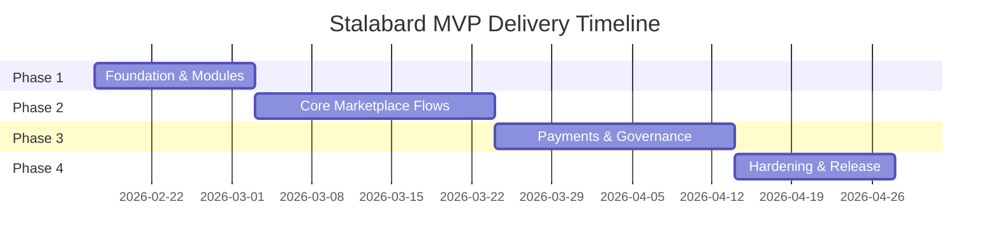

# 🛡️ Stalabard

<p align="center">
  <b>Members-only DAO marketplace powered by Medusa v2</b><br/>
  Verified members can <b>sell + buy</b>, DAO moderation is reactive, and checkout is <b>ELURC-only</b> (Phantom first).
</p>

<p align="center">
  
  
  
  
</p>

---

## 📋 TL;DR

**What:** Members-only marketplace for Elurc DAO where verified NFT badge holders can buy and sell.  
**Why:** Enforce community boundaries, ownership-scoped seller operations, and ELURC-only non-custodial checkout.  
**How:** Medusa v2 backend with custom modules for membership, listings, payments, and DAO moderation.  
**Timeline:** ~10–14 weeks (6 sprints) for MVP release.  
**Status:** Planning complete → implementation starting.

---

## 🎯 Why Stalabard

Stalabard is a marketplace for the Elurc DAO ecosystem where:

- Access is restricted to verified members (NFT badge ownership).
- Every verified member can act as both seller and buyer.
- Seller resources are ownership-scoped (no cross-seller access).
- Listing publication is direct for MVP.
- DAO moderators intervene reactively on flagged issues.
- Checkout enforces ELURC-only, non-custodial payment flows.

---

## 🏛️ Product Pillars

| Pillar | MVP Intent |
|---|---|
| Membership Gating | Server-side verification for protected routes/actions |
| Seller Ownership | Strict ownership boundaries for seller operations |
| Direct Listing Flow | Verified sellers can create and publish directly |
| DAO Moderation | Issue-driven intervention with auditable rationale |
| ELURC Checkout | Phantom-first, non-custodial, verification before order completion |
| Auditability | Structured logs + operational summaries across key domains |

---

## 🗓️ Roadmap



### 🚀 Phase 1 — Foundation (Current)

- Set up Medusa v2 project baseline and module registration.
- Create custom modules: `membership`, `marketplace`, `paymentMeta`, `audit`.
- Define and run initial migrations.

### 🛒 Phase 2 — Core Marketplace Flows

- Implement membership verification and members-only access guards.
- Deliver seller listing draft/update/publish flows with ownership boundaries.
- Expose buyer listing discovery and order attribution.

### 💳 Phase 3 — Payments and Governance

- Integrate ELURC-only checkout policy.
- Implement Phantom-first non-custodial payment flow.
- Add payment verification + deterministic status polling.
- Deliver issue reporting + DAO moderation queue/actions.

### ✅ Phase 4 — Hardening and Release

- Add structured logging and governance/payment audit events.
- Complete E2E and regression suites for release gates.
- Stabilize for first production deployment.

---

## 🛠️ Tech Used

| Layer | Technology |
|---|---|
| Commerce Backend | Medusa v2 (TypeScript, module/workflow/route architecture) |
| Runtime | Node.js |
| Database | PostgreSQL |
| Cache/Coordination | Redis (recommended for idempotency/workflow support) |
| Storefront | Next.js |
| Wallet | Phantom (MVP-first) |
| Payments | ELURC token, non-custodial verification flow |
| Validation | Zod (request schemas) |
| Observability | Structured logs + domain audit events |

---

## 📚 Planning Artifacts

Core planning documents live in `./_bmad-output/planning-artifacts`:

1. Product Brief: [`product-brief-Stalabard-2026-02-14.md`](./_bmad-output/planning-artifacts/product-brief-Stalabard-2026-02-14.md)
2. PRD: [`prd.md`](./_bmad-output/planning-artifacts/prd.md)
3. Architecture Decision Document: [`architecture.md`](./_bmad-output/planning-artifacts/architecture.md)
4. Epics & Stories: [`epics.md`](./_bmad-output/planning-artifacts/epics.md)
5. PRD Validation Report: [`prd-validation-report.md`](./_bmad-output/planning-artifacts/prd-validation-report.md)

---

## 📊 Delivery Snapshot

- Planned epics: **5**
- Planned stories: **23**
- Suggested timeline (balanced team): **~10–14 weeks**
- Recommended cadence: **2-week sprints**

```text
Sprint 1: Membership + Access Foundation
Sprint 2: Seller Listing Lifecycle
Sprint 3: Buyer Discovery + Start Payments
Sprint 4: ELURC Verification + Order Completion
Sprint 5: Moderation + Audit Summaries
Sprint 6: Stabilization, E2E, Release Gates
```

---

## 🏗️ Target Architecture (MVP)

- **Backend:** Medusa v2 (Modules -> Workflows -> API routes)
- **Custom Modules:** `membership`, `marketplace`, `paymentMeta`, `audit`
- **Data:** PostgreSQL (+ Redis recommended for workflow/idempotency support)
- **Storefront:** Next.js (wallet UX, Phantom-first)
- **Integrations:** Blockchain RPC for NFT ownership + payment verification

---

## 📦 Repository Status

This repository is currently in planning-to-implementation transition.
The first commit baseline includes project vision, architecture, and implementation-ready stories.

### 🎬 Immediate Next Steps

1. Scaffold Medusa backend and register custom modules.
2. Generate migrations for membership/marketplace/paymentMeta/audit entities.
3. Implement core workflows (membership, listing, moderation, payment verification).
4. Add route-level validation/auth and ownership guards.
5. Build E2E and regression suites for release gates.

---

## 📄 License

TBD
